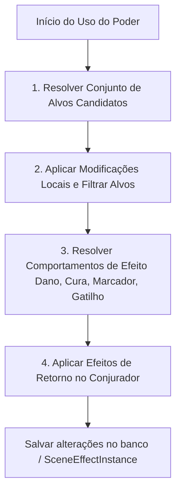
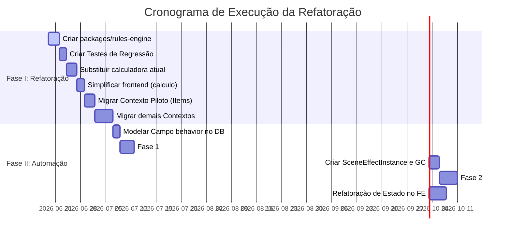

# Aetherium — Plano de Refatoração e Automação

Este documento detalha o planejamento para a reestruturação arquitetural do Aetherium (simplificação e unificação de regras) e o design do novo motor de automação de combates/cenas.

---

## 1. Contexto e Diagnóstico

O Aetherium é um motor de regras de RPG (estilo construtor de personagem / Mutantes & Malandragens) em monorepo: API em NestJS seguindo DDD/Clean Architecture, frontend em React/Vite e banco PostgreSQL via Prisma. 

### 1.1 Problemas Identificados (Ordem de Impacto)

1. **Lacuna de comportamento no motor de regras:** O catálogo modela muito bem o custo aritmético dos poderes (`EffectBase`, `ModificationBase`), mas não expressa mecanicamente *o que o efeito faz* (isso vive em texto livre para o narrador ler). Modificações que alteram alvos ou aplicam efeitos no conjurador (ex: Área, Efeito Colateral) não possuem representação estruturada.
2. **Cerimônia de DDD desproporcional:** Entidades, value objects, repositórios abstratos, mappers, múltiplos arquivos de caso de uso e retornos com `Either` geram boilerplate massivo em fluxos que são CRUDs simples (ex: contas, catálogos).
3. **Agregado `Character` sobrecarregado:** Centraliza ~15 value objects (combate, nível, inventário, condições, etc.) em um único agregado complexo, dificultando testes isolados.
4. **Persistência sem contrato único:** Campos JSONB do personagem são hidratados por mappers sem uma fonte única de verdade dos schemas, tornando alterações estruturais perigosas.
5. **Duplicação de lógica de custo:** Lógica de cálculo de custo e validações de regras existem duplicadas no frontend e backend.
6. **Consultas N+1 na calculadora de custo:** O banco é consultado repetidamente para obter os mesmos efeitos e modificações durante um único cálculo.
7. **Modificações identificadas por comparação de string (hardcoded ID):** Modificações especiais que afetam o comportamento do custo exigem condicionais fixas no código central da calculadora.
8. **Estado do frontend misturado:** Dados vindos do servidor e estados temporários locais da UI não possuem separação clara de responsabilidades.

---

## PARTE I — A REFATORAÇÃO ARQUITETURAL (Simplificação do Sistema)

Esta fase foca em limpar a complexidade desnecessária do código atual, eliminar a duplicação de regras e unificar os schemas de dados.

### 2. Princípios da Simplificação

* **Simplificação do Backend:** Remoção das abstrações do DDD (`AggregateRoot`, mappers, repositórios abstratos, classes de Use Case unitárias e retornos do tipo `Either`). O NestJS será mantido apenas com seus módulos, controllers, services que consomem o Prisma diretamente e filtros de exceção globais para tratamento de erros.
* **Pacote Compartilhado `rules-engine`:** Um pacote local no monorepo contendo toda a lógica de custo de poderes, tabelas de balanceamento universais e schemas Zod.
* **Zod como Fonte Única de Verdade:** Substitui a validação de entidades, os contratos dos mappers e a validação de formulários no frontend.
* **Persistência de Agregados Complexos:** Manutenção de blocos de dados transientes ou altamente acoplados (como atributos, saúde, PE) em JSONB no Postgres, mas rigidamente validados pelo Zod.
* **Estado do Frontend Dividido por Natureza:** Uso de TanStack Query para dados vindos da API, Zustand para estados locais complexos (ex: rascunho de poder em edição) e React Hook Form + Zod para formulários.

### 3. Backend Simplificado (NestJS sem DDD)

#### 3.1 Mapa de Substituição arquitetural

| Estrutura Atual (DDD) | Nova Estrutura Simplificada |
|---|---|
| `Entity` / `AggregateRoot` / `WatchedList` | Tipos puros do TypeScript inferidos de schemas Zod (`z.infer<typeof Schema>`). |
| Value Objects de classe (`PowerCost`, `Domain`) | Objetos simples + funções puras no pacote `rules-engine`. |
| Repositório Abstrato + Prisma Repo + Mapper | Prisma Client instanciado e injetado diretamente no Service. |
| Caso de Uso (uma classe por operação) | Métodos dentro de um Service unificado (ex: `PowersService.update(...)`). |
| Retorno `Either<Left, Right>` | `throw` de exceções customizadas tratadas por um `ExceptionFilter` global do NestJS. |
| `DomainEvents` | Eventos via `@nestjs/event-emitter` (`EventEmitter2`) apenas onde houver desacoplamento real. |
| Transações implícitas do Aggregate | Uso explícito do `$transaction` do Prisma no Service para garantir atomicidade. |

#### 3.2 Estrutura de Pastas de um Contexto

```text
apps/api/src/modules/power-manager/
├── power-manager.module.ts
├── powers.controller.ts
├── powers.service.ts          // Contém a lógica de orquestração de persistência/regras
├── power-arrays.controller.ts
├── power-arrays.service.ts
├── dto/                        // Schemas Zod de entrada/saída (ou reexportados do shared)
└── errors/                     // Classes de erros específicas lançadas via throw
```

#### 3.3 Tratamento de Erros e Controle de Transação

Os erros de negócio passam a ser exceções padrão TypeScript que herdam de classes base de erros. Um filtro global (`HttpExceptionFilter`) captura essas exceções e as traduz para códigos HTTP adequados.

Sempre que um Service realizar múltiplas mutações correlacionadas no banco (ex: atualizar personagem e decrementar recursos), deve-se envelopar as chamadas do Prisma utilizando transações explícitas:

```typescript
async saveCharacterProgress(characterId: string, payload: SyncPayload) {
  await this.prisma.$transaction(async (tx) => {
    // operações de persistência utilizando 'tx'
  });
}
```

### 4. Pacote Compartilhado: `rules-engine` (Módulo de Custo)

Este pacote isolado (sem dependências de frameworks ou do banco) roda tanto no Node.js quanto no browser.

#### 4.1 Estrutura do Pacote
```text
packages/rules-engine/
├── package.json
├── tsconfig.json
├── cost/
│   ├── calculate-power-cost.ts     // Função pura
│   └── tables/
│       └── universal-table.json    // Tabelas de balanceamento e custos de transição
└── schemas/
    └── character.schemas.ts        // Schemas Zod compartilhados
```

#### 4.2 Configuração de Workspace no Monorepo
Para garantir agilidade no desenvolvimento local sem a necessidade de build contínuo do pacote de regras, utiliza-se a dependência `workspace:*` no `pnpm` acompanhada de mapeamento de caminhos (`paths`) no `tsconfig.json` raiz do monorepo:

```json
{
  "compilerOptions": {
    "paths": {
      "@aetherium/rules-engine": ["packages/rules-engine/src/index.ts"]
    }
  }
}
```

### 5. Persistência de Dados e Validação de JSONB

Os blocos do `Character` que vivem em colunas do tipo JSON (atributos, saúde, energia, etc.) continuam utilizando JSONB devido à alta taxa de I/O em bloco único. A validação e evolução dessas estruturas são garantidas pelo Zod com suporte a versionamento e **Write-Back Gradual**.

#### 5.1 Validação e Migração com Write-Back

```typescript
const AttributeSetSchemaV1 = z.object({ forca: z.number() });
const AttributeSetSchemaV2 = z.object({ v: z.literal(2), forca: z.number(), vigor: z.number() });

export function migrateAttributeSet(raw: any): { data: z.infer<typeof AttributeSetSchemaV2>; migrated: boolean } {
  if (!raw.v || raw.v === 1) {
    return {
      data: { v: 2, forca: raw.forca, vigor: 10 }, // Valor padrão para vigor
      migrated: true
    };
  }
  return { data: AttributeSetSchemaV2.parse(raw), migrated: false };
}
```

No Service, se `migrated` for `true`, dispara-se uma atualização em background para persistir o dado atualizado, higienizando progressivamente a base de dados:

```typescript
const { data, migrated } = migrateAttributeSet(rawCharacter.attributes);
if (migrated) {
  this.prisma.character.update({
    where: { id: characterId },
    data: { attributes: data }
  }).catch(err => this.logger.error('Falha no write-back do JSONB', err));
}
```

---

## PARTE II — A NOVA FASE: MOTOR DE AUTOMAÇÃO

Esta fase introduz a representação mecânica das regras e o pipeline de execução e resolução de combates/cenas em tempo de execução.

### 6. Modelagem de Comportamento Primitivo

Para permitir a automação mecânica, as tabelas de catálogo do banco (`EffectBase`, `ModificationBase`) receberão um campo estruturado contendo a definição do comportamento da regra.

#### 6.1 Comportamentos Primitivos (no `EffectBase`)

Os comportamentos mecânicos são discriminados pela propriedade `kind`:

```typescript
type EfeitoBehavior =
  | { kind: 'DANO'; formula: string; tipoDano: string }
  | { kind: 'RECUPERACAO'; recurso: 'PV' | 'PE'; formula: string }
  | { kind: 'MARCADOR'; label: string; duracao: 'CENA' | 'PERMANENTE'; visivel: boolean }
  | { kind: 'GATILHO'; evento: string; condicao: CondicaoEstruturada; efeitosFilhos: string[] };
```

#### 6.2 Estrutura de Condições de Gatilho

Para evitar a complexidade e os riscos de segurança associados à interpretação dinâmica de strings de código (ex: `eval` ou interpretadores complexos), as condições dos gatilhos são armazenadas como estruturas de dados simples de comparação:

```typescript
type CondicaoEstruturada = {
  field: 'target.markers' | 'target.pv' | 'caster.pe' | 'event.damageType';
  operator: 'CONTAINS' | 'LESS_THAN' | 'EQUALS' | 'EXISTS';
  value: any;
};
```

#### 6.3 Transformações de Alvo e Efeitos das Modificações (no `ModificationBase`)

As modificações globais ou locais aplicadas a um efeito alteram o escopo de alvos ou aplicam penalidades ao conjurador:

* **Modificações de Alvo (`targetingEffect`):** `AREA` (afeta todos os alvos em um raio/cone), `SELETIVO` (permite filtrar alvos na área) ou `LIMITADO` (restringe a lista de alvos válidos).
* **Modificações do Conjurador (`casterEffect`):** `EFEITO_COLATERAL` (aplica parte do efeito ou dano de volta no conjurador).

### 7. Resolvendo Efeitos de Cena (`SceneEffectInstance`)

Para evitar poluir a entidade persistente do `Character` com estados temporários de combate (como buffs de curta duração, debuffs, marcas e gatilhos passivos), cria-se um modelo relacional dedicado chamado `SceneEffectInstance`.

```prisma
model SceneEffectInstance {
  id                 String   @id @default(uuid())
  sceneId            String
  kind               String   // "MARCADOR" | "GATILHO"
  sourceCharacterId  String
  targetCharacterId  String?
  sourcePowerId      String
  payload            Json     // Detalhes adicionais validados pelo Zod
  expiresAt          DateTime?
  createdAt          DateTime @default(now())

  @@index([sceneId])
  @@index([sceneId, targetCharacterId])
  @@index([sceneId, kind])
  @@map("scene_effect_instances")
}
```

#### 7.1 Garbage Collection de Efeitos de Cena

Para evitar o crescimento indefinido da tabela de efeitos de cena no banco de dados, adota-se duas estratégias de limpeza:
1. **Limpeza Explícita:** Uma ação do narrador para "Finalizar Cena" remove em lote todos os registros associados ao `sceneId`.
2. **Limpeza Temporal:** Uma tarefa em lote programada (Cron Job) ou gatilho no backend que executa periodicamente para expurgar registros onde `expiresAt < NOW()`.

### 8. Pipeline de Execução do Motor de Automação

O pipeline de uso de um poder segue quatro passos sequenciais no `rules-engine`:



1. **Resolver Alvos Candidatos:** Combina o alcance base do poder com a modificação global do tipo `targetingEffect` (ex: se for `AREA`, calcula as coordenadas ou lista inicial de afetados).
2. **Filtragem de Alvos por Efeito:** Aplica modificações locais de cada efeito individualmente (ex: se um efeito específico do poder for `LIMITADO`, remove alvos da lista que não se qualificam).
3. **Resolução de Efeito:**
   * Se `DANO` ou `RECUPERACAO`: calcula a fórmula (rolando dados via biblioteca de rolagem) e aplica nos atributos de vida/energia dos alvos.
   * Se `MARCADOR` ou `GATILHO`: cria um registro na tabela `SceneEffectInstance` referenciando o `sceneId` correspondente.
4. **Resolução de Efeitos do Conjurador:** Processa modificações do tipo `casterEffect` (como sofrer dano por efeito colateral).

---

## 9. Cronograma e Sequência de Migração

A transição está dividida em etapas claras para garantir a estabilidade do sistema produtivo em cada etapa do processo.



### Etapa 1: Isolamento de Regras e Testes (Refatoração)
1. Criar o pacote `packages/rules-engine` e configurar caminhos e workspaces (`pnpm` + `tsconfig`).
2. Mapear testes de regressão no backend comparando as saídas da calculadora atual com as saídas esperadas.
3. Mover a lógica de cálculo de custos do `PowerCostCalculator` para o pacote compartilhado como funções puras.
4. Substituir a calculadora no backend (com busca de dados em lote) e validar contra os testes de regressão.
5. Substituir a lógica duplicada do frontend importando as funções do `rules-engine`.

### Etapa 2: Desmonte do DDD no Backend (Refatoração)
6. Migrar o contexto `item-manager` (piloto) removendo as classes de DDD, usando Services do NestJS consumindo Prisma diretamente e schemas Zod.
7. Validar com testes e então estender a simplificação arquitetural aos demais contextos (`power-manager`, `character-manager` e `accounts`).
8. Aplicar o Zod com versionamento estruturado e Write-Back Gradual aos campos JSONB do `Character`.

### Etapa 3: Motor de Automação (Nova Fase)
9. Modificar os schemas do banco adicionando a representação do comportamento (`behavior`) nos catálogos de efeitos e modificações.
10. Implementar os comportamentos primitivos básicos (`DANO`, `RECUPERACAO` e `MARCADOR`) e validações das transformações de alvo (`AREA` e `LIMITADO`).
11. Criar a tabela `SceneEffectInstance` no Prisma e programar os mecanismos de limpeza (Garbage Collector).
12. Validar o pipeline com os poderes *Laço de Ódio* e *Pacto do Vingador*.
13. Implementar a etapa de escuta ativa de gatilhos em tempo de execução no `SceneEffectInstance` e validar contra o poder *Agonia*.

### Etapa 4: Estado do Frontend (Refatoração & Polimento)
14. Migrar os dados vindos do servidor para o TanStack Query.
15. Implementar stores Zustand específicos para estados de interface complexos (como o rascunho em edição no construtor de poder).
16. Substituir formulários por React Hook Form + Zod.

---

## 10. Questões Abertas e Monitoramento

* **Lista Expandida de Comportamentos:** É prudente revisar um lote de 20 a 30 poderes reais antes de fixar as propriedades definitivas do `EfeitoBehavior` para evitar refatorações precoces no motor de automação.
* **Testes de Resistência:** Definir como o pipeline tratará testes de atributos para anular/reduzir efeitos (ex: salvamento de Vigor para reduzir dano pela metade).
* **Nível de Autonomia do Motor:** Alinhar se a execução deve aplicar o dano diretamente na vida dos personagens ou gerar um histórico de ações pendentes para aprovação do narrador da mesa.
* **Concorrência de Ações:** Analisar se o uso concorrente de efeitos de cena por múltiplos jogadores demandará bloqueio otimista nos registros de `SceneEffectInstance`.
